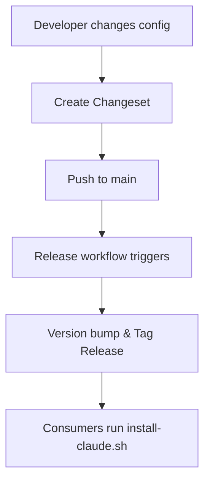

# 📦 Versioning & Distribution Strategy Analysis

**Status**: Completed & Implemented (Automated via Changesets & Shell Installer)

---

## 💡 The Fundamental Question

> **We're not packaging runtime code - we're distributing configuration and documentation. How do we version that?**

---

## 🎯 What Are We Distributing?

### 1. CLAUDE.md Guidelines
*   **Type**: Markdown documentation / Claude Code configurations.
*   **Size**: Reduced to ~150 lines after splitting.
*   **Consumers**: Developers using Claude Code or other AI coding assistants.
*   **Update frequency**: Medium (new patterns, guidelines updates).
*   **Breaking changes**: Possible (structural changes, rules reorganization).

### 2. Claude Code Agents
*   **Type**: Markdown files with YAML frontmatter.
*   **Consumers**: Claude Code users running custom enforcement agents.
*   **Update frequency**: Medium.

### 3. Personal Dotfiles
*   **Type**: Zsh shell configs, Git configurations, Vim/LunarVim settings.
*   **Consumers**: Personal system configuration.
*   **Update frequency**: Low.

---

## 🚦 Distribution Strategy Implementation

We implemented a **hybrid approach** combining **Changesets (versioning)** and a **Shell Installer (distribution)**.



### 1. Changesets Integration
We use `@changesets/cli` to automate semver version bumping and changelog generation.
*   **Configuration**: Stored under `.changeset/config.json`.
*   **Release process**: Controlled via `package.json` scripts.

### 2. Shell Installer (`install-claude.sh`)
Provides a simple, one-liner command to fetch, update, and install the configuration files from the releases.
```bash
# Install the latest version
curl -fsSL https://raw.githubusercontent.com/nguyen-phan123/.dotfiles/main/install-claude.sh | bash
```

---

## 📅 Implementation Milestones

### Milestone 1: Split CLAUDE.md
- `[x]` Research import syntax.
- `[x]` Create split plan.
- `[x]` Extract content to `docs/`.
- `[x]` Update main `CLAUDE.md` with absolute imports.
- `[x]` Test imports using `/memory` command.

### Milestone 2: Implement Versioning
- `[x]` Add minimal `package.json` at root.
- `[x]` Initialize Changesets structure.
- `[x]` Create GitHub Actions release flows.
- `[x]` Test tag creation.

### Milestone 3: Release v2.0.0
- `[x]` Merge split `CLAUDE.md` updates.
- `[x]` Tag major version release (v2.0.0).
- `[x]` Update documentation and README versioning instructions.

### Milestone 4: Shell Installer
- `[x]` Create [install-claude.sh](file:///Users/diqit/Documents/GitHub/config/dotfiles/install-claude.sh) script.
- `[x]` Test installer execution on MacOS & Linux shell environments.
- `[x]` Support installation of specific versions (e.g., `./install-claude.sh v2.0.0`).
