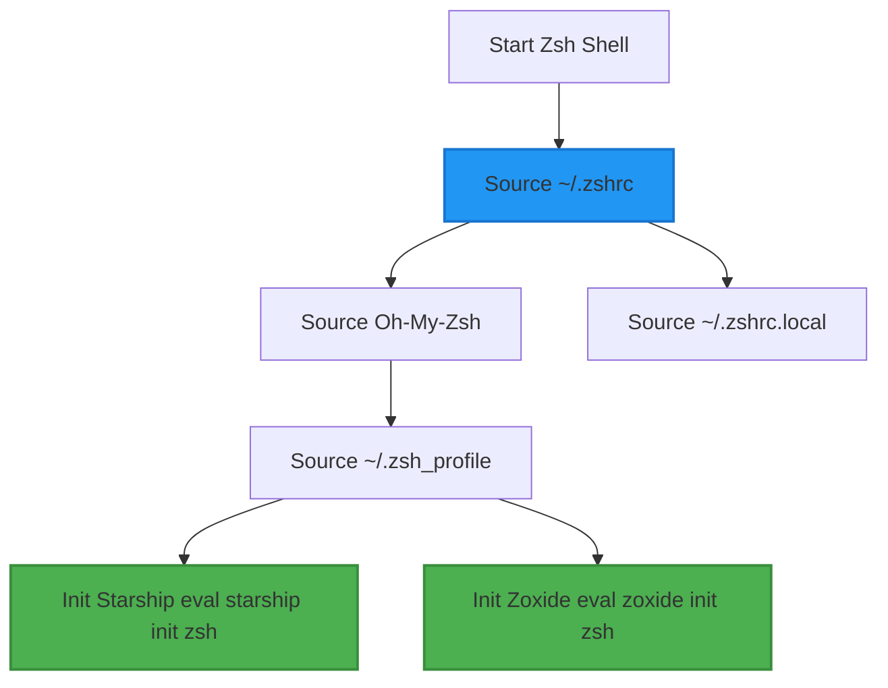

# Issue #0005: Migrate Zsh Theme from Powerlevel10k to Starship

**Status**: Open
**Labels**: ready-for-agent, feature, configuration

## Problem Statement

The user wants to transition from the legacy **Powerlevel10k (p10k)** zsh theme/prompt to **Starship** across their environment. The dotfiles repository currently has a mixed configuration where some old files (like `~/.p10k.zsh` and `.zshrc.old`) reference Powerlevel10k, but the new dotfiles zsh configuration is intended to use Starship. We need to clean up and fully transition to Starship.

## Solution

1. Verify that `starship` is initialized in `shell/zsh/.zsh_profile`.
2. Remove the old Powerlevel10k configurations and files (`~/.p10k.zsh`).
3. Ensure no active references to p10k are loaded in `shell/zsh/.zshrc` or `shell/zsh/.zsh_profile`.
4. Document the transition.

## Flow Diagram

